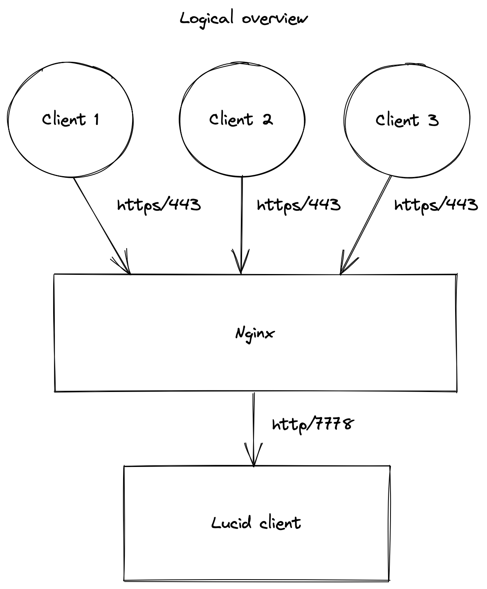

# Lucid task

## Overview

### This task requires the following:
  1. Create an init/systemd config that starts the LucidLink client on boot and stops it on shutdown. 
  2. Ensure that the password is not visible on: ps ax
  3. Export the REST interface to be accessible from the outside in a secure way.
  4. Secure the VM.

### Tools used to complete the task:
  1. Systemd configuration file
  2. Nginx (as reverse proxy)
  3. Bash script to automate the process

### Overview of the architecture

